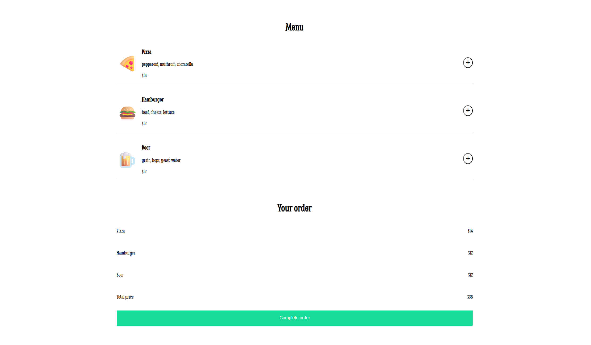

# 🍔 Jimmy's Diner – Ordering App

A simple interactive food ordering web app built with **HTML**, **CSS**, and **JavaScript**. A project from Scrima from course [The Frontend Developer Careet Path](https://scrimba.com/frontend-path-c0j).
Users can browse the menu, add items to their order, see the total price, and complete checkout with a payment form.

## ✨ Features

- **Dynamic Menu Rendering** – Menu items are loaded from a JavaScript array (`data.js`) and displayed on the page.
- **Add to Order** – Clicking the “+” button adds an item to the order section.
- **Live Total Calculation** – The order total updates automatically as items are added.
- **Checkout Flow** – A modal dialog (`<dialog>`) opens to collect payment details.
- **Thank You Message** – Displays a personalized thank-you note after payment submission.

## 🛠 Technologies Used

- **HTML5** – Structure and semantic elements
- **CSS3** – Styling, responsive design, hover effects
- **JavaScript (ES Modules)** – DOM manipulation, event handling, form handling
- **Google Fonts** – Smythe font for diner-style aesthetics

## 🚀 How It Works

1. **Menu Display**
   - Menu data is stored in `data.js` as an array of objects.
   - `renderMenu()` maps over the array to create HTML for each menu item.

2. **Adding Items**
   - Event delegation listens for clicks on `.btn-add` buttons.
   - Selected items are stored in the `foodOrder` array.

3. **Order Summary**
   - The `.ordered-items` section lists each added item.
   - `.total-price` updates with the sum of all item prices.

4. **Checkout**
   - Clicking "Complete order" opens a `<dialog>` element with a payment form.
   - On form submit, the order is hidden and a thank-you message is displayed.

## 📸 Screenshots

*Menu View*  

*Order View*  

*Checkout Dialog*  

## 💡 Possible Improvements

- Allow removing items from the order
- Quantity control for each menu item
- Persist cart in `localStorage` so it stays on reload
- Improve form validation with custom messages

